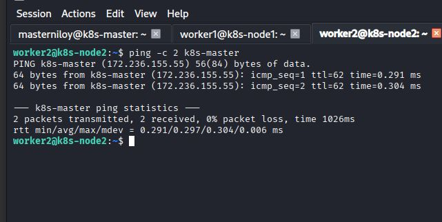
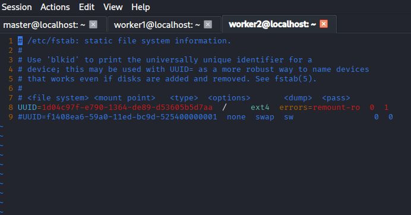
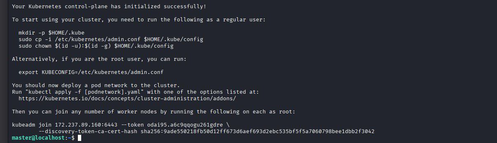
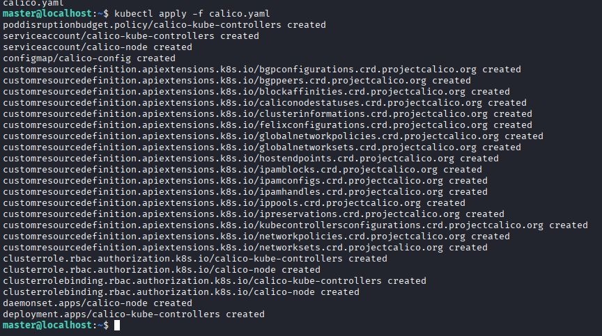
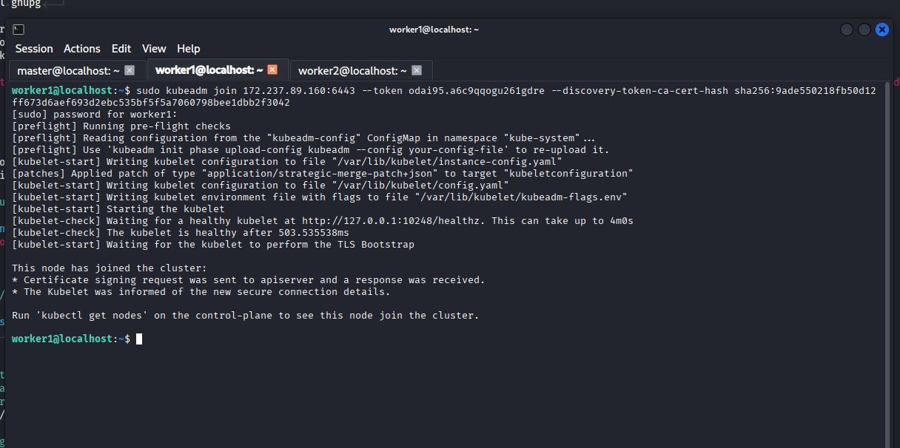
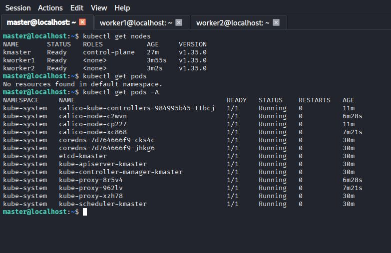

# Manual Deployment of Distributed Kubernetes Environments

**Standard Operating Procedure (SOP)** for multi-node cluster configuration and node orchestration

## Overview

This document provides a comprehensive, step-by-step framework for the manual deployment of a multi-node Kubernetes cluster. Rather than utilizing automated orchestration, this document is designed to provide granular control over the installation process, ensuring a deep understanding of the underlying architecture and configuration requirements.

We will use `Ubuntu 24.04 LTS` servers for all nodes.

## Requirements

Minimum hardware requirements should have been met for creating a operational cluster.

**Hardware Configurations:**

- 2 vCPU (Minimum)
- RAM: 4 GB (Recommended)
- Stable Internet Connection via Ethernet or WiFi
- 80 GB Storage

**Other:**

- A `YAML` file for a Declarative Manifest
- `sudo` access for setting system-wide configuration in all nodes
- Firewall rules should not restrict setting up an internal network between nodes

## Setting Hostnames

First of all, unique hostnames must be set for each nodes for better communication over the network.
Let Master Node IP be `192.168.0.100`, Hostname to be set `k8s-master`.

```bash
sudo hostnamectl set-hostname k8s-master
```

Similarly on Worker Node: Assumming Node IP `192.168.0.101`, Hostname `k8s-worker`.

```bash
sudo hostnamectl set-hostname k8s-worker
```

### Editing `/etc/hosts`

`Vim` text editor will be used for all text editing cases.

```bash
vim /etc/hosts
```

Append after `127.0.0.1		localhost` line in every nodes

```
# K8s Nodes
192.168.0.100 k8s-master
192.168.0.101 k8s-worker
```

> N.B: Do NOT Overwrite `localhost` line. This attempt can destroy accessing LocalHost on the nodes

### Check connectivity using `ping` command

From worker node, try pinging master

```bash
ping -c 4 k8s-master
```

If this succeeds, connectivity is established.



## Execute in All Nodes followings

### Turn off Swap Space

```bash
sudo swapoff -a
sudo vim /etc/fstab    # Comment out /swapfile or swap type containing line
```



### Ensure the Linux kernel loads two "plugins" (modules) it needs to manage containers

```bash
sudo vim /etc/modules-load.d/k8s.conf
```
Write
```
overlay
br_netfilter
```

This configuration:

- **overlay:** Enables the kernel module required for the OverlayFS driver, allowing Kubernetes to layer container file systems efficiently over the host OS.
- **br_netfilter:** Enables the kernel bridge to pass traffic to iptables for filtering, which is mandatory for Kubernetes to manage networking and firewalling between Pods across nodes. 

Enable the configuration by running
```bash
sudo modprobe overlay && sudo modprobe br_netfilter
```

### Network Traffic Routing (Sysctl)

```bash
sudo vim /etc/sysctl.d/k8s.conf
```
Write the following lines
```
net.bridge.bridge-nf-call-iptables  = 1
net.bridge.bridge-nf-call-ip6tables = 1
net.ipv4.ip_forward                 = 1
```
Apply without reboot
```
sudo sysctl --system
```
The output should contain those lines. If they are found command is executed successfuly.

### Install Containerd, kubeadm, kubelet, kubectl

**Containerd** is a high-performance, industry-standard container runtime that acts as the execution engine for the cluster; it handles the complete container lifecycle, including image pulling from registries, managing low-level storage (snapshots), facilitating metadata execution, and supervising container processes through communication with the Linux kernel's namespaces and cgroups.

**Supporting Component Roles:**

- kubelet: The primary node agent that monitors the local state of the node and executes Pod specifications by communicating with the container runtime via the Container Runtime Interface (CRI).

- kubeadm: A cluster-bootstrap utility that automates the generation of TLS certificates, static Pod manifests, and administrative configurations required to initialize the Control Plane (Master Node).

- kubectl: The binary interface that serializes user-defined YAML manifests and transmits them to the Kubernetes API server via RESTful calls for cluster state management.

It is convenient to automate installing Containerd, kubeadm, kubelet, kubectl because of its complexity. Make a shell script naming `install_containerd-kubes.sh`

```bash
vim install_containerd-kubes.sh
```
And write in the file the following
```bash
#!/bin/bash

set -euxo pipefail

# Declaring Important Variables
ARCH="$(dpkg --print-architecture)"
KUBERNETES_VERSION="$(curl -fsSL https://dl.k8s.io/release/stable.txt)"
PACKAGE_VERSION="$(echo "${KUBERNETES_VERSION}" | cut -d'.' -f1-2)"

# Installing Prerequisites
sudo apt update
sudo apt install -y curl gpg gnupg software-properties-common apt-transport-https ca-certificates

# Installing Containerd Runtime
echo "deb [arch=${ARCH} signed-by=/etc/apt/keyrings/docker.gpg] https://download.docker.com/linux/ubuntu $(. /etc/os-release && echo "${VERSION_CODENAME}") stable" | sudo tee /etc/apt/sources.list.d/docker.list > /dev/null
sudo apt update
sudo apt install containerd.io

sudo systemctl daemon-reload
sudo systemctl enable containerd --now
sudo systemctl start containerd.service

echo "Containerd runtime installed successfully"

# Generate the default containerd configuration
sudo containerd config default | sudo tee /etc/containerd/config.toml

# Enable SystemdCgroup clear
sudo sed -i 's/SystemdCgroup = false/SystemdCgroup = true/g' /etc/containerd/config.toml

# Restart containerd to apply changes
sudo systemctl restart containerd

curl -LO "https://github.com/kubernetes-sigs/cri-tools/releases/download/${KUBERNETES_VERSION}/crictl-${KUBERNETES_VERSION}-linux-${ARCH}.tar.gz"
sudo tar zxvf "crictl-${KUBERNETES_VERSION}-linux-${ARCH}.tar.gz" -C /usr/local/bin
rm -f "crictl-${KUBERNETES_VERSION}-linux-${ARCH}.tar.gz"
curl -fsSL "https://pkgs.k8s.io/core:/stable:/${PACKAGE_VERSION}/deb/Release.key" | sudo gpg --dearmor -o /etc/apt/keyrings/kubernetes-apt-keyring.gpg

echo "deb [signed-by=/etc/apt/keyrings/kubernetes-apt-keyring.gpg] https://pkgs.k8s.io/core:/stable:/${PACKAGE_VERSION}/deb/ /" | sudo tee /etc/apt/sources.list.d/kubernetes.list
sudo apt update && sudo apt install -y kubelet kubeadm kubectl

# Hold kubes from automatic updates
sudo apt-mark hold kubelet kubeadm kubectl
```
Make the script  executable and run it on the terminal
```bash
chmod +x install_containerd-kubes.sh
./install_containerd-kubes.sh
```

### Configure kubelet

```bash
sudo vim /etc/default/kubelet
```
`KUBELET_EXTRA_ARGS=` will be shown. Append in the same line their local IP addresses for each nodes using the flag `--node-ip=`

On Master Node
```KUBELET_EXTRA_ARGS=--node-ip=192.168.0.100
```
On Worker Node
```
KUBELET_EXTRA_ARGS=--node-ip=192.168.0.101
```

## Execute separately on Master Node and Worker Nodes the followings

### On Master Node

```bash
sudo kubeadm init --pod-network-cidr=10.244.0.0/16
# You can assign K8s internal IPs differently based on your CIDR
# Here it is just an example
```
Read the output of the command. The output should contain the following lines



```bash
mkdir -p $HOME/.kube
sudo cp -i /etc/kubernetes/admin.conf $HOME/.kube/config
sudo chown $(id -u):$(id -g) $HOME/.kube/config
```
Do this instruction if **non-root** user

Apply `YAML` file on Master Node.
Let filename be `calico.yaml`.
Use
```bash
kubectl apply -f calico.yaml
```



### On Worker Nodes

The `kubeadm init` command on master node also generate a `kubeadm join` command.
Execute the `kubeadm join` command on each worker nodes. This will successfully create the cluster.



### Verify on Master Node

After all of the above done successfully, Master Node has become the cluster's **Control Plane**.

Run these commands to verify

```bash
kubectl cluster-info
kubectl get nodes
kubectl get pods -A
```

Cluster-Info


Nodes & Pods


